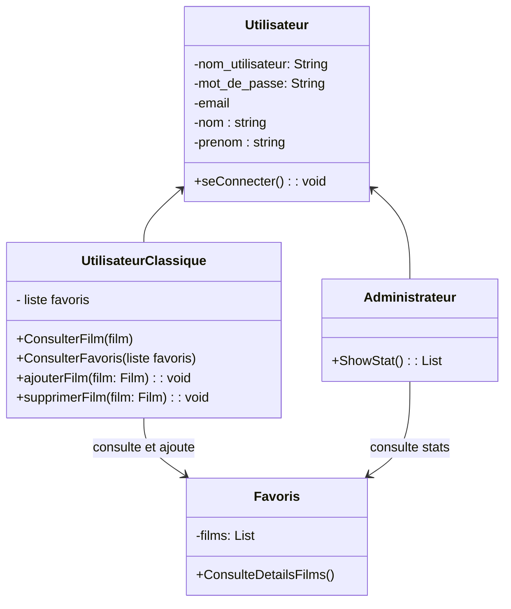

# Starwars Film
Projet transversale Python 
SN1 EPSI Lille

## Technologies et outils:


- [GitHub](https://github.com/alexkjzz/PythonTP)
- [Python 3.12](https://docs.python.org/3.12/)
- [Swapi](https://swapi.dev/)
- [SQLite](https://swapi.dev/)
- [SqlAlchemy](https://www.sqlalchemy.org/)

## Préparation
### 1- Convention de nommages : 
```py
# snake_case
my_variable

# snake_case
def get_user_data():

# CamelCase
class MyClass():
```

### 2- Version

```
Changement de version
X.0.0 Nouveautée majeur
0.X.0 petite nouveautée 
0.0.X Nouveautée minime
```


### 4. Communication
- Discord
- [Clickup](https://sharing.clickup.com/9015532609/l/h/8cnw721-375/51e4cf6ce2b9993)
- [WikiGithub](https://github.com/alexkjzz/PythonTP)


### 5. Stratégie de développement
- Peer programming
- Management avec ClickUp
- Revue de code


### Choix des librairies et veilles technologiques avec POC 


### MLD

````mermaid
classDiagram
  
    class Utilisateur{
        -Id_user
        -user_name
        -user_surname
        -password
        -user_email
        -rôle

    }


    class Favoris {
        -Id_user
        -Titre_Film
        -Id_film
       
    }

   

    Utilisateur --> Favoris : Ajouter

````

### Diagramme de classes



## User stories
### Feature: Ajouter un film en favoris

#### En tant que client je souhaite enregistrer un des films de starwars en tant que favoris afin de le retrouver facilement plus tard
- Il faut pouvoir consulter la liste des films *(numéro d'épisode, titre, release_date)*
- En choisir un pour l'ajouter aux favoris
- Une confirmation doit être faite à l'utilisateur pour lui confirmer l'ajout en favoris

#### En tant que client je souhaite consulter ma liste de films favoris afin de retrouver rapidement mes films sauvegardés
- On affiche les mêmes infos que pour la liste des films mais uniquement les films favoris
- L'utilisateur doit accéder à ses favoris par une interface dédiés

#### En tant que client je souhaite supprimer un film de ma liste afin de gérer efficacement les films que j'ai sauvegardés
- La suppression se fait depuis la liste des films favoris
- L'utilisateur sélectionne un film pour l'effacer
- Il faut demander confirmation à l'utilisateur avant l'effacement
- Il faut confirmer l'effacement à l'utilisateur


----------
### Feature: Connexion 
#### En tant que client je souhaite me connecter afin que l'application se souvienne de moi à l'avenir.
- Connexion pour nom d'utilisateur et mot de passe
- Les favoris sont enregistrés pour un utilisateur spécifique

#### En tant qu'administrateur je souhaite pouvoir me connecter afin de gérer et consulter des statistiques de l'application
- L'administrateur est un rôle spécial qui peut consulter des statistiques inaccessible aux autres utilisateurs

----------
### Feature: Stats
#### En tant qu'administrateur je souhaite consulter le nombre d'utilisateurs ayant ajoutés en favoris les films star wars
- Se matérialise par une liste de films ainsi que le nombre d'ajout en favoris
- Les films sont triés du plus favoris au moins.


# Installation Instructions

1. Clonez ce repository dans votre répertoire local.
2. Ouvrez le powershell et executé ces commandes :

```bash
pip install Flask Flask-Login 
```
```bash
pip install SQLAlchemy
```
```bash
pip install Flask-SQLAlchemy
```
```bash
pip install Flask-WTF
```
```bash
pip install requests
```
```bash
pip install email_validator
```
3. Lancer le fichier app2.py