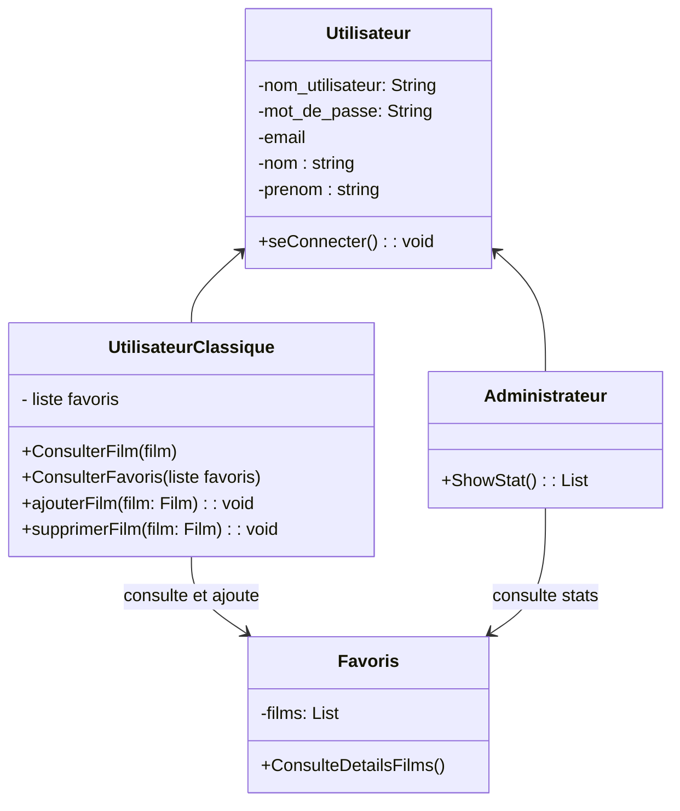

```mermaid
classDiagram
  
    class Utilisateur{
        -nom_utilisateur: String
        -mot_de_passe: String
        -email
        -nom : string
        -prenom : string
        +seConnecter(): void

    }


    class Utilisateur Classique{
        
        - liste favoris
        +ConsulterFilm(film)
        +ConsulterFavoris(liste favoris)
        +ajouterFilm(film: Film): void
        +supprimerFilm(film: Film): void
    }

    class Administrateur {
        +ShowStat(): List<Film>
    }

    class Favoris {
        -films: List
        +ConsulteDetailsFilms()
       
    }

   

    Utilisateur <-- Utilisateur Classique
    Utilisateur <-- Administrateur 
    Utilisateur  Classique-->  Favoris : consulte et ajoute
    Administrateur   -->  Favoris : consulte stats
    
    


```