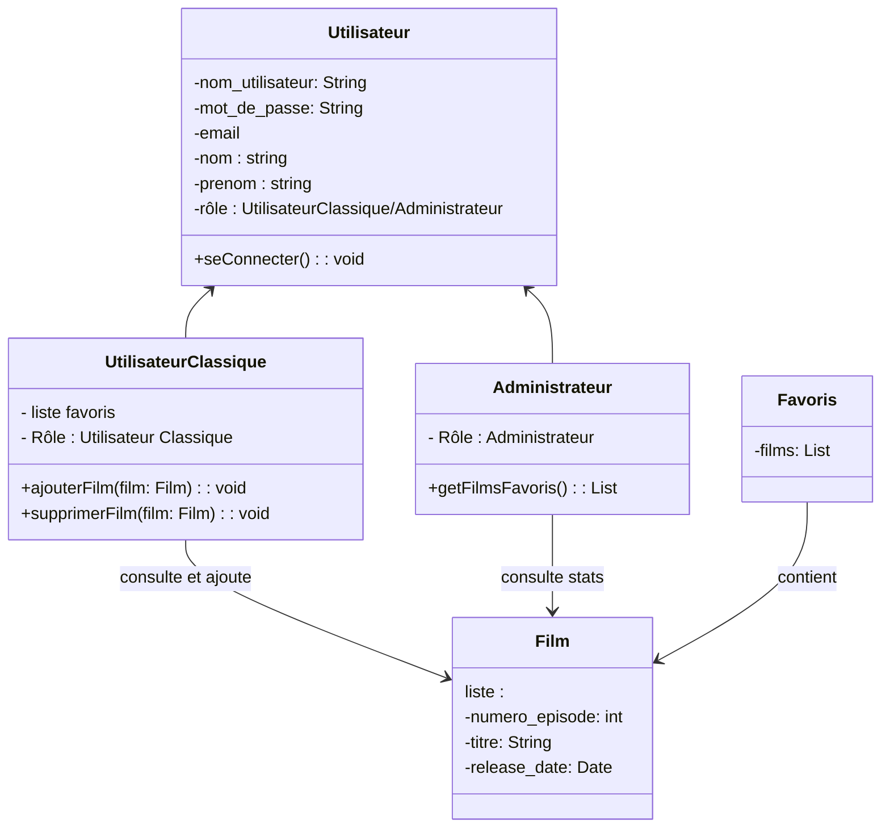

```mermaid
classDiagram
  
    class Utilisateur{
        -nom_utilisateur: String
        -mot_de_passe: String
        -email
        -nom : string
        -prenom : string
        -rôle : UtilisateurClassique/Administrateur 
        +seConnecter(): void

    }


    class Utilisateur Classique{
        
        - liste favoris
        - Rôle : Utilisateur Classique
        +ajouterFilm(film: Film): void
        +supprimerFilm(film: Film): void
    }

    class Administrateur {
        - Rôle : Administrateur
        +getFilmsFavoris(): List<Film>
    }

    class Film {
        liste :
        -numero_episode: int
        -titre: String
        -release_date: Date
       
    }

    class Favoris {
        -films: List<Film>
        
    }

    Utilisateur <-- Utilisateur Classique
    Utilisateur <-- Administrateur 
    Utilisateur  Classique-->  Film : consulte et ajoute
    Administrateur   -->  Film : consulte stats
    Favoris  -->  Film : contient
    


```